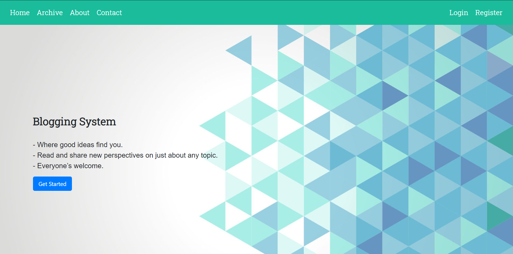
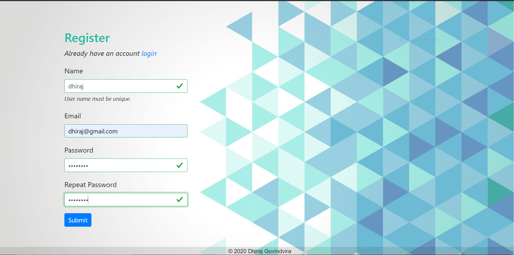
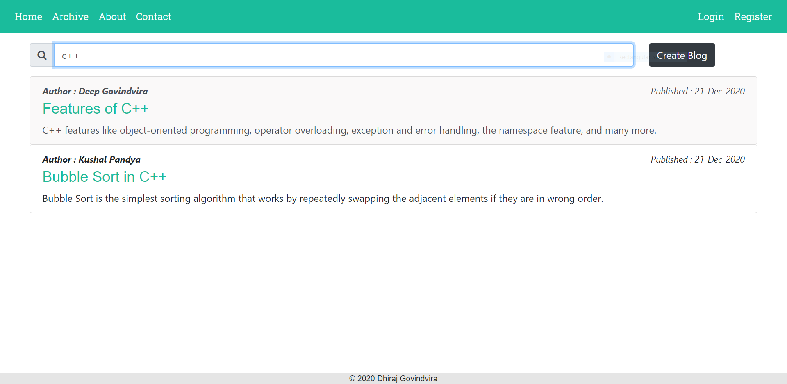
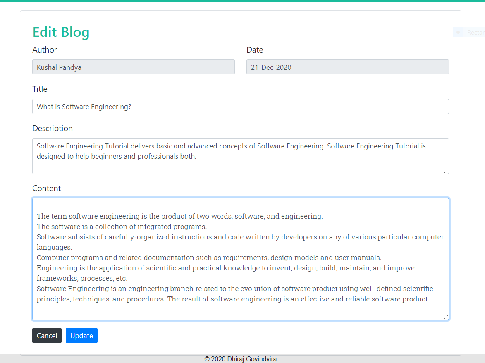

# Blogging-System
 
- it's a website dedicated for blogger.
- technology stack : **MEAN**

### content
- [Features](#features)
- [Installation](#installtion)
- [How to run?](#how-to-run-)
- [Scrrenshorts](#screenshots)
 
### Features
- login / register.
- show list of blogs.
- search blogs based on author, title, published date. 
- provide crud operations, edit, update, delete blogs.
- markdown syntax for blog content.

### Installtion
- install [nodejs](https://nodejs.org/en/) and [angular cli](https://cli.angular.io/)
```
git clone https://github.com/Dhiraj-01/Blogging-System.git or manually download this project 
cd backend
npm install

cd frontend
npm install
```

### How to Run ?
- you can directly double click on [run.bat](https://github.com/Dhiraj-01/Blogging-System/blob/main/run.bat) file. or
```
cd backend
node index.js
   
cd frontend
ng serve -o
```

### Screenshots

**Home**


**About**


**Contact**


**Login**


**Register**


**Archive blogs**


**search**


**blog view**


**blogs create**


**blogs edit**

